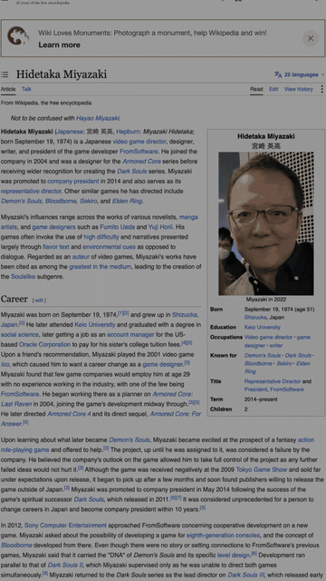

# script-to-video

**Turn a script into a narrated, word-synced explainer video.** Free local voice (Kokoro), images and articles from the web with licences recorded, clips, and browser-rendered motion graphics. 16:9 for YouTube or 9:16 for Reels, Shorts and TikTok. No After Effects, no cloud, no API keys.

It also ships as a **Claude Code skill** (`SKILL.md`): drop the folder in `~/.claude/skills/` and Claude plans the shots, fetches the pictures, and builds the video from your script.

> **What to expect.** The first build is a starting point, not a finished video. It gets you from a script to a synced, illustrated draft in minutes; the remaining work is direction: tell the AI (or edit `build.py` yourself) what to change in the overall style, which images or clips to swap, where the timing or alignment is off, which shot should be a diagram instead of a photo. Two or three rounds of notes are normal. This is a time saver, not a final result.

<table align="center">
  <tr>
    <td align="center" width="62%"><a href="https://github.com/isabellagreco1997/script-to-video/releases/download/examples-v2/how-does-a-door-work.mp4"></a><br><b>How does a door work</b> · 16:9 · 1:49 · <a href="https://github.com/isabellagreco1997/script-to-video/releases/download/examples-v2/how-does-a-door-work.mp4">▶ watch the full video</a><br><sub>Wikipedia images + article screenshots + diagrams drawn in code, male Kokoro voice</sub></td>
    <td align="center" width="38%"><a href="https://github.com/isabellagreco1997/script-to-video/releases/download/examples-v2/dark-souls-story-916.mp4"></a><br><b>The story of Dark Souls</b> · 9:16 · 0:58 · <a href="https://github.com/isabellagreco1997/script-to-video/releases/download/examples-v2/dark-souls-story-916.mp4">▶ watch the full video</a><br><sub>trailer clips + article captures + a counter, same voice</sub></td>
  </tr>
</table>

Both full videos are on the [releases page](https://github.com/isabellagreco1997/script-to-video/releases/tag/examples-v2); the contact sheets the build writes are in each example's `out/` folder.

## How it works

```
script.txt ──voice──▶ narration.wav ──align──▶ words.json
                                                  │
assets (web images, article shots, clips) ────────┼──▶ build.py (shot list, anchored to phrases)
                                                  ▼
                              timeline.js ──render──▶ frames ──encode──▶ video.mp4 (+ sfx, music)
                                                                └──audit──▶ contact sheets
```

1. **Voice**: Kokoro TTS, sentence by sentence with natural gaps. Any recorded narration works too.
2. **Align**: whisper word timestamps. Every shot is anchored to a phrase, so re-recording the voice never breaks the sync.
3. **Assets**: images the relevant Wikipedia articles actually use (licensed, with a manifest and an attributions file), article screenshots scrolled to the paragraph, video clips cut into frames, made cards and diagrams.
4. **Timeline**: a tiny Python DSL. `tl.shot("the hinge", bg=tl.bg("hinge.jpg", kb="zin"))` means "when the narrator says *the hinge*, cut to this picture and slowly push in".
5. **Render**: headless Chrome draws every frame deterministically from the timeline. Encode with ffmpeg. Audit on contact sheets: two frames per shot, plus a dense sheet with a frame every half second.

## Install

```bash
git clone https://github.com/isabellagreco1997/script-to-video
cd script-to-video
pip install -e .            # pillow numpy kokoro-onnx
pip install mlx-whisper     # Apple Silicon; elsewhere: pip install faster-whisper
npm install                 # puppeteer-core (uses your installed Chrome)
brew install ffmpeg         # or apt / choco
script-to-video setup       # downloads the Kokoro voice model once (~330 MB)
```

## Make a video

```bash
mkdir my-video && cd my-video
# 1. write script.txt (150 words ≈ 1 minute; short sentences; spell out C L I, G P U)
script-to-video voice script.txt work/narration.wav --voice am_puck      # af_bella, bm_george, ...
script-to-video align work/narration16.wav work/                        # → work/words.json + sentences.txt
# 2. fetch pictures (see examples/*/fetch_assets.py) into work/assets/
# 3. write build.py (see examples/*/build.py) — one visual per sentence, anchored to its phrase
script-to-video build build.py                                          # render + sfx + encode + audit
```

`work/sentences.txt` is your shot-planning sheet. `build.py` ends with `tl.write(...)`, which prints how much of the runtime is word slams (keep it under 10%), which shots run over 8 s, and any anchor it couldn't find.

### The timeline DSL

```python
from script_to_video import Timeline
tl = Timeline("work/words.json", w=1920, h=1080)        # w=1080, h=1920 for a reel
tl.shot(0.0)                                              # black until the first key word
tl.shot("the hinge", bg=tl.bg("hinge.jpg", kb="zin", dark=0.1))
tl.shot("two leaves", layers=[tl.I("hinge_diagram.png", 360, 60, 1200, anim="slideU", plain=True, zoomTo=1.6, origin="85% 55%")])
tl.shot("Linus Yale", layers=[tl.I("yale.jpg", 700, 60, 520, rot=-3), tl.C("LINUS YALE JR.", 770, 880, i=0.3)])
tl.shot("a shape test", layers=[tl.T("A SHAPE TEST.", 380, 420, fs=170, rot=-2, i=tl.rel("shape test"))])
tl.shot("every shortcut", bg=tl.clip("gameplay2", kb="zout", fit="cover"))
tl.write("work/timeline.js")
```

* `shot(phrase, see="what the viewer should be looking at")` starts a shot when the phrase is spoken and moves the cursor forward. `"a|b"` = alternatives for what whisper might have heard. Writing `see=` for every shot *is* the shot plan: a thing → its photo, a mechanism → a diagram that changes state, a number → a counter, a claim → the article.
* `tl.pic(src)` puts a **whole** image on screen, centred, sized from the file so nothing bleeds off the edge (`zoomTo` is capped to keep it inside). `tl.bg(src)` shows a whole still over a blurred copy of itself; `fit="cover"` only for wide photos and clips.
* `tl.write()` reports word-slam share, shots over 8 s, missing anchors, order problems **and images used twice**. The build also writes a dense audit sheet (a frame every half second): watch that as a viewer would before showing anyone.
* `tl.rel("word")` = seconds from the shot start to a word, for a layer's `in`. Elements appear on their word.
* Backgrounds: `kb` = zin, zout, panL, panR, panD, panU, punch, still; `dark` dims; `fit` cover/contain; `flash=0` white flash on the cut.
* Layers: `I` image (pop, slideU/D/L/R, fade, `zoomTo` + `origin` for a slow push), `T` white Impact word with black stroke, `C` black chip, `G` clip as a layer, `counter` counts up.

## Assets with licences

```python
from script_to_video import assets
assets.wikipedia_images("Hinge", "work/assets/wp", "work/manifest.json", limit=10, prefix="hinge_")   # what the article uses
assets.commons_file("File:Pin tumbler with key.svg", "work/assets/pin.png", "work/manifest.json")       # a named file (SVG → PNG)
assets.commons_fetch("brass butt hinge", "work/assets/hinge.jpg", "work/manifest.json")                 # keyword search (noisier)
assets.capture([dict(name="wiki", url="https://en.wikipedia.org/wiki/Latch", w=1600, h=1000, scroll="#Types", out="work/assets/wiki_latch.png")], "work")
assets.clip_frames("work/clips/trailer.mp4", "gp1", "work", fps=12, start=18, dur=7)                    # → gifframes/gp1 + gifmeta
assets.attributions("work/manifest.json", "work/attributions.txt")                                     # paste into the description
```

Clips you download (trailers, gameplay, screen recordings) stay out of git; the examples fetch them at build time.

## The rules that make it look right

Written in full in [`SKILL.md`](SKILL.md). The short version:

1. Black until the first key word, then **every element appears on its word**.
2. **Pictures, not words.** Kinetic text on about 5% of the runtime, on the thesis lines only.
3. One image per idea, never reused, and it must literally match what is being said.
4. Cuts every 2–4 s, nothing over 8 s, no two adjacent shots with the same camera move.
5. Deliberate black on the reflective line. End on black. No outro card.
6. Music barely there. Soft booms only on flash cuts and black beats.
7. Audit the contact sheets before anyone else sees it.
8. Never overwrite a delivered file. Bump the version.

## Examples

* [`examples/how-does-a-door-work/`](examples/how-does-a-door-work) — 16:9, 1:49. Hinge, latch, pin tumbler lock, Linus Yale. Every picture from Wikipedia/Commons with the licence in `work/attributions.txt`.
* [`examples/dark-souls-story-916/`](examples/dark-souls-story-916) — 9:16, 0:58. Trailer clips via yt-dlp, article captures reflowed at phone width, a live counter, a "YOU DIED" card drawn in code.

Run either with `python examples/<name>/fetch_assets.py` then `script-to-video build examples/<name>/build.py`.

## License

MIT. Kokoro is Apache-2.0; image licences are recorded per file in each example's manifest.
