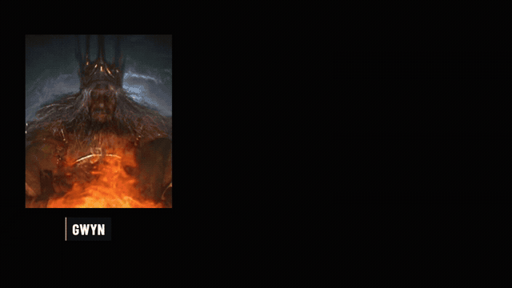

# Dark Souls: The Choice

A 1:58 widescreen explanation of Dark Souls I, from the First Flame to the player's final choice. Made with Codex using the local `script-to-video` skill and pipeline. First cut; spoilers for the base game and both endings.

[Watch or download the full video](https://github.com/isabellagreco1997/script-to-video/releases/download/examples-v2/dark-souls-the-choice-draft-v1.mp4)

- **Format:** 1920 × 1080, 16:9, 30 fps.
- **Voice:** local Kokoro `bm_george`, aligned to the script with Whisper.
- **Edit:** 52 word-anchored shots, gameplay and cinematic excerpts, character reveals, and diagrams explaining the flame, undead curse and two bells.
- **Audio:** original ambient music, restrained sound effects, narration-led mix.
- **Checks:** two frames per shot, a dense half-second contact-sheet review, and full-file decoding.

## Included files

- [Narration script](script.txt)
- [English subtitles](captions.en.srt)
- [Production notes and source credits](CREDITS.md)

The production used an adapted HTML stage with bounded frame loading and widescreen presentation. This folder contains the showcase, script, subtitles and credits; it is not a standalone rebuild package.

Game footage and screenshots retain their original rights. See the credits for sources; the repository's MIT licence does not apply to those assets.
